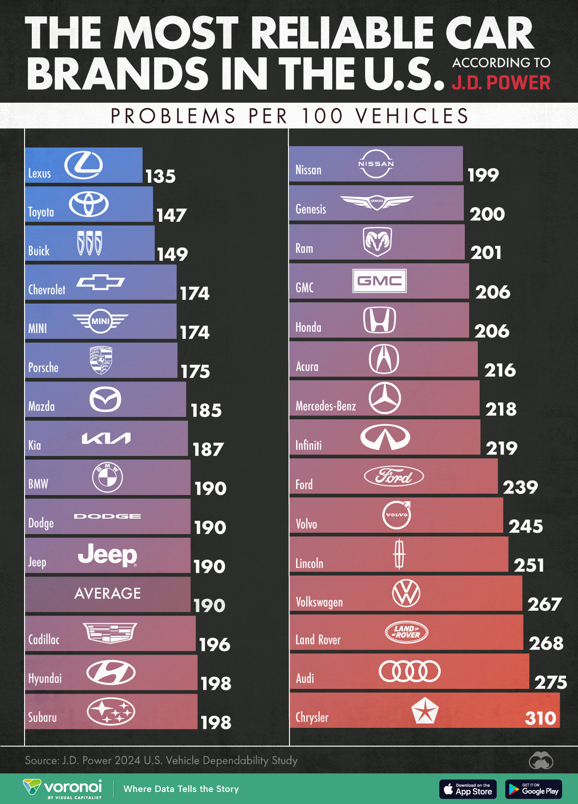

| [home page](https://cmustudent.github.io/tswd-portfolio-templates/) | [data viz examples](dataviz-examples) | [critique by design](critique-by-design) | [final project I](final-project-part-one) | [final project II](final-project-part-two) | [final project III](final-project-part-three) |

# Title
Text here...

_For each step below, you should document your progress as you move forward.  In terms of tone, think of the writeup as though you're keeping journal of your step-by-step process.   You should include a any insights you gained from the critique method, and what it led you to think about when considering the redesign.  You should talk about how you moved next to the sketches, and any insights you gleaned from your user feedback.  Document what you changed based on the user feedback in your redesign.  Finally, talk about what your redesigned data visualization shows, why you selected the data visualization you did, and what you attempted to show or do differently._

_You can include screenshots, sketches or other artifacts with your narrative to help tell the story of how you moved through the process.  Again, make sure to avoid including any personally identifying information about your interviewees (don't list full names, etc.).  While this template serves as a guide, make sure to reference the assignment writeup on Canvas for the official guidance.  This template does not include all guidance mentioned on the assignment page._

## Step one: the visualization

_Include link to the original data visualization (or screenshot - make sure to correctly cite your sources, etc.).  Include paragraph or two on why you selected this particular data visualization.  For obvious reasons, the data visualization you select should come from a publicly accessible source._

Source: https://www.visualcapitalist.com/ranked-the-most-reliable-car-brands-in-the-u-s/#google_vignette

I chose this data visualization because I’m planning to buy a car after I graduate, and I’ve come across many similar rankings that feel unreliable or lacking in transparency. This is the first one I’ve seen that actually provides a clear metric—problems per 100 vehicles—to explain how reliability is measured.

## Step two: the critique
I found this visualization really useful because it clearly states the metric used—problems per 100 vehicles—which is something I haven’t seen in other rankings. Most just list the rankings without explaining the methodology. That said, I was initially confused by the numbers being over 100, and I think there might be a more intuitive way to present that information.  

I’m not sure how I feel about the use of both brand logos and names. It seems redundant, but I know a lot of visualizations do this. The bar graph itself is easy to read, but it took me a while to notice the “average” bar, which I think is actually really helpful but doesn’t stand out enough.  

Visually, I found the blue-to-red color gradient unnecessary and even a little distracting. Since the data is simple, a clean bar chart would be just as effective—maybe even better. I’d also be interested in trying a unit chart to see if it makes the information more engaging without overcomplicating it.  

I think the primary audience for this tool is people looking for a reliable car, and in that sense, it does its job well. I could quickly find the top-ranked cars and adjust my search accordingly.  

If I were to make changes, I’d focus on aesthetics—reducing unnecessary color and using it more intentionally to highlight important details, like the “average” bar. I’d also reconsider how the problems-per-100-vehicles metric is presented since it wasn’t immediately intuitive to me. Maybe showing problems per vehicle would be easier to grasp, but I’d want to test that with others to see if it’s just a personal preference.

## Step three: Sketch a solution

## Step four: Test the solution

_Before you conduct your interviews, prepare a simple script.  Use this as a guide and as a way to take notes as you go forward. Come up with your own list of questions you want to ask for the selected visualization. Keep the questions broad so you can get the most value out of your feedback. Then, document answers to your questions here._

Questions to ask (modify these for your own interviews): 

- Can you tell me what you think this is?

- Can you describe to me what this is telling you?

- Is there anything you find surprising or confusing?

- Who do you think is the intended audience for this?

- Is there anything you would change or do differently?

Results: 

_Don't identify or share personally identifiable information (PII) about the people you spoke to._

| Question | Interview 1 | Interview 2 |
|----------|-------------|-------------|
|   Can you tell me what you think this is?       |             |             |
|   Can you describe to me what this is telling you?       |             |             |
|  Is there anything you find surprising or confusing?        |             |             |
| Who do you think is the intended audience for this?         |             |             |
|Is there anything you would change or do differently?          |             |             |

Synthesis: 

_What patterns in the feedback emerge?  What did you learn from the feedback?  Based on this feedback, come up with what design changes you think might make the most sense in your final redesign._

## Step five: build the solution

_Include and describe your final solution here. It's also a good idea to summarize your thoughts on the process overall. When you're done with the assignment, this page should all the items mentioned in the assignment page on Canvas(a link or screenshot of the original data visualization, documentation explaining your process, a summary of your wireframes and user feedback, your final, redesigned data visualization, etc.)._

## References
_List any references you used here._

## AI acknowledgements
_If you used AI to help you complete this assignment (within the parameters of the instruction and course guidelines), detail your use of AI for this assignment here._

