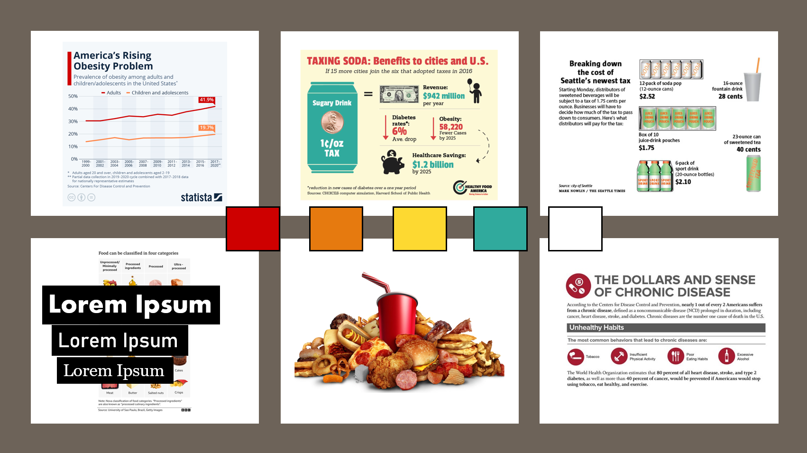

| [home page](https://cmustudent.github.io/tswd-portfolio-templates/) | [data viz examples](dataviz-examples) | [critique by design](critique-by-design) | [final project I](final-project-part-one) | [final project II](final-project-part-two) | [final project III](final-project-part-three) |

# Wireframes / storyboards

[Shorthand Preview](https://preview.shorthand.com/hPCHpoX8hXgyKuto)

# User research 

## Target audience
I am hoping to target White U.S. citizens, so these are the folks I sought out to interview.

## Interview script

| Goal | Questions to Ask |
|------|------------------|
| To understand what users take away from the website. | What are you getting out of the website? |
| To identify who they believe the website is targeting. | Who do you think the target audience is? |
| To assess whether the story flows well. | Do you think the story is cohesive? |
| To see if they like the way the website looks. | What do you think about the aesthetics of the website? |
| To determine if anything hinders comprehension. | Was there anything you found confusing about the website? |

## Interview findings

| Questions | Interview 1 | Interview 2 | Interview 3 | Interview 4 |
|-----------|-------------|-------------|-------------|-------------|
| **What are you getting out of the website?** | That UPFs are bad. | Things are tiered within our nutrition system, so I learned about that, and I learned about targeted ads about certain communities. | UPFs are bad for health and affect marginalized communities more than others. | I got that UPFs are very prevalent and they were related to the top 3 causes of death in the US and that some communities are more vulnerable than others. |
| **Who do you think the target audience is?** | Activists, general population, voter base. | U.S. citizens. | The general public, policymakers, executives of affordable/green food production. | It’s hard to say anything but general audience, I don’t think it’s for congresspeople, could be for kids? |
| **Do you think the story is cohesive?** | Story is very compelling, evokes good emotion. I liked that it introduced the concept and how social justice overlaps with it, because social justice could be perceived as controversial. | Yeah, I like how it was the four things and where are the 4 things and why it’s important. | Yes. | Yes? But I do have a comment about your conclusion: you say Black and Latino kids, but it seems that the sugar tax would be regressive and make their food more expensive? |
| **What do you think about the aesthetics of the website?** | It worked very well. | I think it looked good; the only issue was some of the graphs with the orange were slightly challenging for me to see. | Yes, I like the color theme. | I think they’re pretty good. I thought they made sense being next to each other and blending, but I feel some of the graphs could be a bit more persuasive. |
| **Was there anything you found confusing about the website?** | Image association with some of the statistics, making conclusions that weren’t intended. | No, I think the only thing was when you have the UPFs—I didn’t get what ultra-processed foods were. At the end, it says to reach out to our congressperson—maybe give them a sentence to copy and paste and send it to them. | The 2x thing—do only Black kids see it, or are they 2x more likely? I didn’t understand what the first graph was trying to show—what is the percentage in terms of? Is it of the overall diet? | I think the first graph is a bit confusing; it’s not immediately clear what is being presented. And the one that showed the top 4 causes of death—I think it would be more striking if we were way below the top 4 causes. |

# Identified changes for Part III

| Research Synthesis | Anticipated Changes for Part III |
|--------------------|----------------------------------|
| The picture of the Kellogg's box confuses people into thinking the statistic is about Kellogg's specifically. | Look for a picture that matches the color theme but includes more than one brand. |
| It's not immediately apparent that UPF = ultra-processed food. | Include UPF in parentheses the first few times I mention ultra-processed food. |
| Some users may be discouraged by not knowing what to write to their Congressperson. | Include a letter people can copy and paste to send to their Congressperson. |
| The statistic about Black children seeing ads 2x more than their white counterparts is confusing. | I don't think I'll do anything about this—only one person mentioned it, and I think the statistic is generally straightforward. |
| The orange in the graphs may be a bit difficult to see. | Make the orange in the graphs a bit darker. |
| Some people may think sugar taxes might be regressive in making food more expensive for minority groups. | Emphasize that a sugar tax would be on sugary drinks only by underlining "drinks." |
| The first chart is not very clear to some users. | Change the title of the graph to "More than half of calories in the staple 'Western Diet' come from UPFs." |

From my interviews I gathered that people generally liked what the website looked like but there are a few things I could do to make it that much better.

# Moodboards / personas

My moodboard helped me SO much. I'm honestly not generally very good at creative things but it was helpful that every time I looked for a picture I could go back to my mood board and see what colors I should make it. And I edited shorthand to have the colors I was using put straight into the platform as story colors and it helped me A TON. I really like the way it came out.
